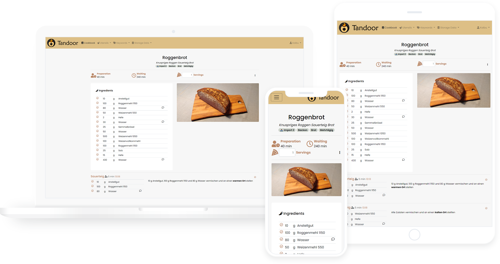

<h1 align="center">
   
  
   
  Stillroom
   
</h1>

<h4 align="center">The recipe manager that allows you to manage your ever growing collection of digital recipes.</h4>

<a href="install/docker.md">Installation</a> •
<a href="index.md">Docs</a> •
<a href="https://github.com/BrendenWalker/Stillroom/issues">Issues</a>

## Core Features
- Manage your recipes with a fast and intuitive editor
- Plan multiple meals for each day
- Shopping lists via the meal plan or straight from recipes
- Cookbooks collect recipes into books
- Share and collaborate on recipes with friends and family

## Made by and for power users

- Powerful and customizable search with fulltext support and [TrigramSimilarity](https://docs.djangoproject.com/en/3.0/ref/contrib/postgres/search/#trigram-similarity)
- Create and search for tags, assign them in batch to all files matching certain filters
- Quickly merge and rename ingredients, tags and units
- Import recipes from thousands of websites supporting [ld+json or microdata](https://schema.org/Recipe)
- Support for fractions or decimals
- Easy setup with Docker and included examples for Kubernetes
- Customize your interface with themes
- Sync files with Dropbox and Nextcloud

## All the must haves

- Optimized for use on mobile devices
- Localized in many languages
- Import your collection from many other [recipe managers](features/import_export.md)
- Many more like recipe scaling, image compression, printing views and supermarkets

This application is meant for people with a collection of recipes they want to share with family and friends or simply
store them in a nicely organized way. A basic permission system exists but this application is not meant to be run as
a public page.

Stillroom is an independent fork of [Tandoor Recipes](https://github.com/TandoorRecipes/recipes).

## Get in touch

Open an issue on [GitHub](https://github.com/BrendenWalker/Stillroom/issues) for bugs, setup help, and feature requests.

## Docs

Installation, configuration, and feature docs are in this folder. Docker setup starts at [install/docker.md](install/docker.md).
The published image is `ghcr.io/brendenwalker/stillroom`. If you are coming from Tandoor Recipes, see [Migrating from Tandoor](https://github.com/BrendenWalker/Stillroom#migrating-from-tandoor).
